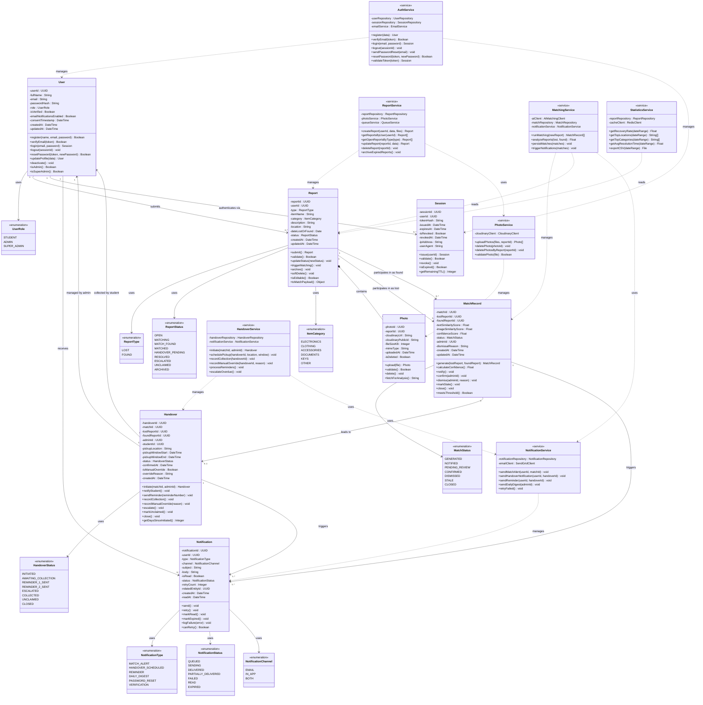

# CLASS_DIAGRAM.md — CampusFind: Smart Campus Lost & Found System
## Assignment 9: Class Diagram in Mermaid.js

---

## 1. Full Class Diagram

---

## 2. Key Design Decisions

### 2.1 Composition vs. Association for Photo and Report

Photo uses **composition** with Report (`*--`) rather than simple association. This is because a Photo cannot exist independently of a Report — if a Report is deleted, all its Photos must also be deleted from Cloudinary. Composition enforces this lifecycle dependency at the design level, making it clear to any developer reading the diagram that Photo management is always the responsibility of the Report that owns it.

### 2.2 Service Layer as Separate Classes

The diagram separates domain entities (User, Report, Photo, MatchRecord, Handover, Notification, Session) from service classes (AuthService, ReportService, MatchingService, etc.). This reflects a **layered architecture** pattern where domain entities hold data and basic self-validation logic, while services hold business workflows that coordinate between multiple entities. This separation makes each class easier to test in isolation and easier to extend without breaking other parts of the system.

### 2.3 Enumerations for All Constrained Values

Every attribute with a fixed set of valid values (status fields, role, type, category, channel) is modelled as an enumeration class. This prevents invalid state values from entering the system and makes the valid state machine explicit in the class diagram itself, directly linking to the state transition diagrams from Assignment 8.

### 2.4 MatchRecord References Both Reports

The MatchRecord holds explicit foreign key references to both `lostReportId` and `foundReportId`. This is a deliberate denormalisation — while the Report entity could theoretically be navigated from the MatchRecord through its relationship lines, storing both IDs directly on the MatchRecord makes match queries significantly faster (no joins required) and makes the audit trail self-contained. This was a performance-over-normalisation trade-off justified by NFR-08 (matching must complete in under 60 seconds).

### 2.5 Alignment with Assignment 8 State Diagrams

Every `status` enumeration in this class diagram corresponds directly to the states defined in the Assignment 8 state transition diagrams. `ReportStatus` values map exactly to the Lost Item Report state diagram. `MatchStatus` maps to the AI Match Record state diagram. `HandoverStatus` maps to the Handover Record state diagram. This ensures that the class diagram and the behavioural models describe the same system without contradiction.

### 2.6 Traceability to Requirements

| Class | Key Requirements | User Stories |
|---|---|---|
| User | FR-01, FR-02, FR-12 | US-001, US-002, US-012 |
| Report | FR-03, FR-04, FR-05 | US-003, US-004, US-005 |
| Photo | FR-03, FR-04, FR-11 | US-003, US-004, US-011 |
| MatchRecord | FR-05, FR-07 | US-005, US-007 |
| Handover | FR-08 | US-008 |
| Notification | FR-06 | US-006 |
| Session | FR-02, NFR-09 | US-002 |